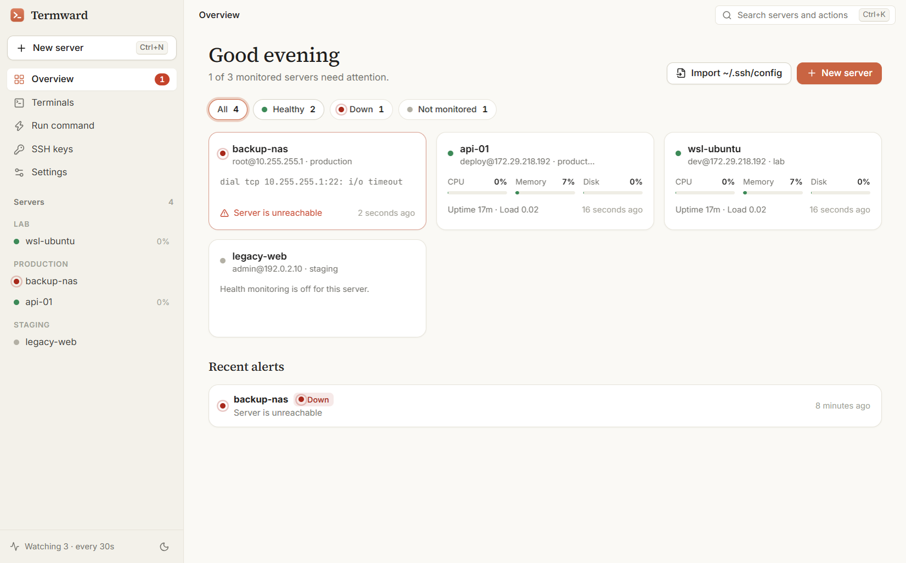
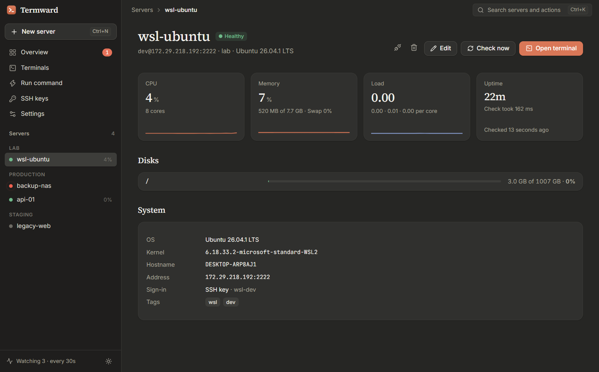
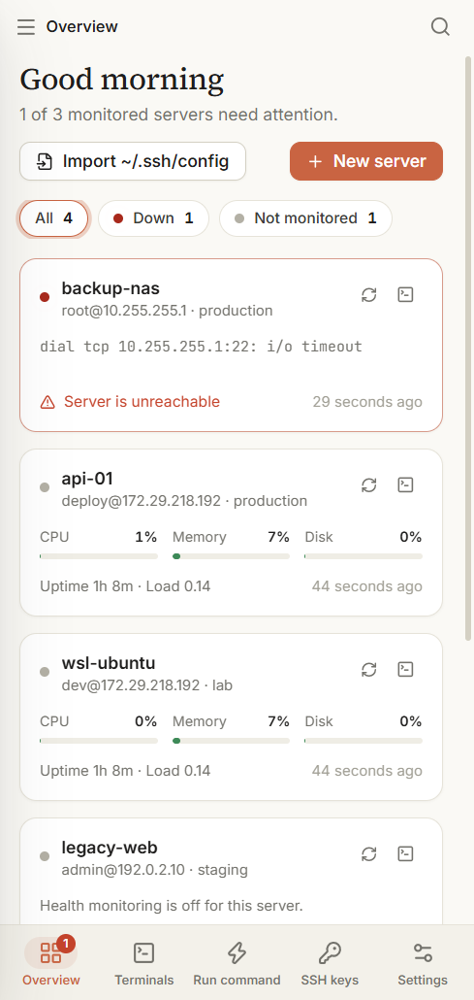
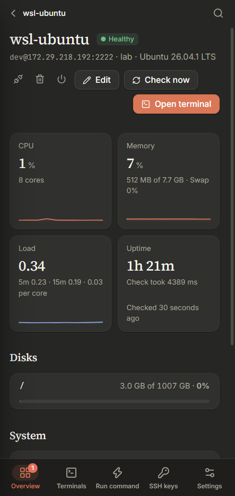
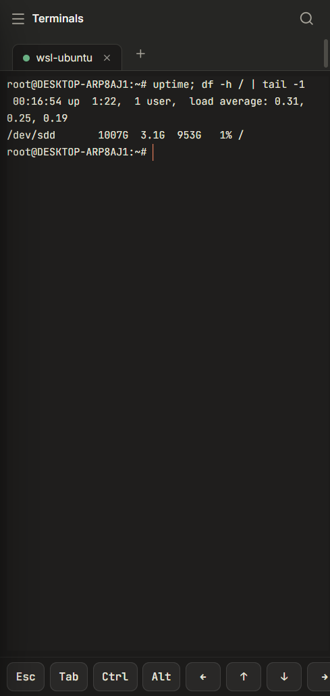
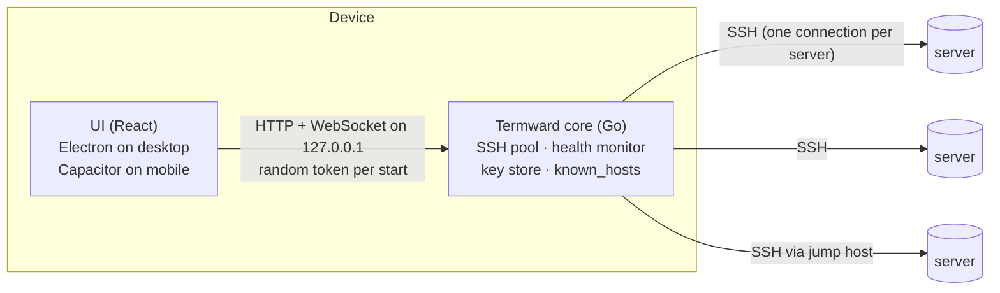

<p align="center">
  
</p>

<h1 align="center">Termward</h1>

<p align="center">
  <b>An SSH manager that keeps watch.</b><br />
  Manage many servers, open terminals, handle SSH keys — and hear about problems before your users do.<br />
  Desktop (Windows · macOS · Linux) and mobile (Android · iOS). Free and open source.
</p>

<p align="center">
  <a href="https://github.com/nguyenquocanhz/termward/actions/workflows/ci.yml"></a>
  <a href="LICENSE"></a>
</p>

<p align="center">
  
</p>

## Why Termward

Most SSH clients wait for you to connect before you learn anything. Termward
keeps a lightweight connection to every server you add and **checks its health
continuously** — CPU, memory, disks, load, failed systemd services and Docker
containers — then **notifies you** when something goes down, turns critical or
recovers. Nothing is installed on the servers: checks are a single POSIX `sh`
script sent over the SSH connection you already have.

| | |
|---|---|
| **Proactive health alerts** | Desktop/mobile notifications when a server is down, a disk fills up, a service fails or a container keeps restarting. A problem must show up on two checks in a row, so short spikes stay quiet. |
| **Many servers, one place** | Groups, tags, search, jump hosts (ProxyJump), import from `~/.ssh/config` in one click. |
| **Fast terminals** | xterm.js with tabs, one multiplexed SSH connection per server, `Ctrl/⌘+K` to jump to any server. |
| **Run everywhere at once** | Run a command on many servers in parallel, compare output and exit codes, save snippets. |
| **SSH key management** | Create Ed25519 / RSA / ECDSA keys, import from `~/.ssh`, deploy to a server like `ssh-copy-id` (SELinux-aware) and switch the server to the new key only after it is verified. |
| **Power actions** | Reboot or shut down a server (root, passwordless sudo or sudo password), with alerts paused during the planned downtime. |
| **Safe by default** | Host keys verified with first-use confirmation and change detection, secrets in the OS keychain, no telemetry. See [SECURITY.md](SECURITY.md). |
| **English & Tiếng Việt** | Light and dark themes, bilingual UI. |

<p align="center">
  
</p>

<p align="center">
  
  &nbsp;
  
  &nbsp;
  
</p>

## How it works



- **`core/`** — the Go core. The same code runs as a sidecar process on desktop
  (`cmd/termwardd`) and as an in-app library on Android/iOS (`mobile/`, built with
  gomobile). It owns every SSH connection, so terminals, health checks and
  commands share one authenticated connection per server.
- **`app/`** — one React + TypeScript UI for every platform: an Electron shell
  for desktop and a Capacitor shell (`android/`, `ios/`) for mobile. The design
  is warm and quiet on purpose: it only raises its voice when a server needs you.

## Install

Download the latest build from **[Releases](https://github.com/nguyenquocanhz/termward/releases)**:

| Platform | File |
|---|---|
| Windows 10/11 (x64) | `Termward-Setup-x.y.z.exe` |
| macOS (Apple Silicon) | `Termward-x.y.z-mac-arm64.dmg` |
| Linux (x64) | `Termward-x.y.z-linux-x86_64.AppImage` or `Termward-x.y.z-linux-amd64.deb` |
| Android 7+ | `Termward-x.y.z.apk` |
| iOS | build from source with Xcode (see below) |

Builds are not code-signed with a paid certificate yet:

- **Windows:** SmartScreen may warn — choose *More info → Run anyway*.
- **macOS:** the first time, right-click the app → *Open*, or run
  `xattr -dr com.apple.quarantine /Applications/Termward.app`.
- **Android:** allow installing apps from your browser/file manager when asked.

On desktop, closing the window keeps Termward monitoring from the tray; use
**Quit** (the ⏻ button, the tray menu, or Settings → Window) to stop it. On
Android, enable **Settings → Monitor in the background** to keep getting
alerts while the app is closed.

## Build from source

Requirements: **Go 1.26+**, **Node.js 22+**.

```bash
git clone https://github.com/nguyenquocanhz/termward
cd termward/app
npm ci
npm run dev          # builds the core, starts Vite + Electron with hot reload
npm run dist         # installer for the current OS in app/release/
```

Run the tests:

```bash
cd core && go test ./...
cd app && npm run typecheck
```

### Android

Also needs the Android SDK + NDK and JDK 21.

```bash
go install golang.org/x/mobile/cmd/gomobile@latest golang.org/x/mobile/cmd/gobind@latest
gomobile init
cd app
npm run mobile:core:android   # Go core → android/app/libs/termwardcore.aar
npm run mobile:web            # UI build + cap sync
cd android && ./gradlew assembleDebug
```

### iOS (macOS + Xcode)

```bash
cd app
npm run mobile:core:ios       # Go core → native/ios-core/Termwardcore.xcframework
npm run mobile:web
npx cap open ios              # then Run in Xcode
```

### Developing against a real shell without touching OpenSSH

`core/cmd/devsshd` is a throwaway SSH server (keys only) you can run inside WSL
or a VM:

```bash
cd core && GOOS=linux go build -o devsshd ./cmd/devsshd
./devsshd -authorized-keys ~/.ssh/id_ed25519.pub -addr 127.0.0.1:2222
```

Run the core with `--dev` (port 7717, token `dev`) and open
`http://localhost:5173/?core=http://127.0.0.1:7717&token=dev` after
`npm run dev:web` to work on the UI in a browser.

## Roadmap

- SFTP file browser and port forwarding
- Alert channels: Telegram, Slack, webhooks
- Headless `termwardd` mode for 24/7 monitoring from a server
- Encrypted sync of hosts between devices

Ideas and pull requests are welcome — see [CONTRIBUTING.md](CONTRIBUTING.md).

---

## Tiếng Việt

**Termward** là trình quản lý SSH mã nguồn mở, **chủ động báo sức khỏe máy chủ**:
theo dõi CPU, RAM, ổ đĩa, tải, dịch vụ systemd lỗi và container Docker, rồi gửi
thông báo ngay khi máy chủ mất kết nối, chuyển sang nghiêm trọng hoặc ổn định trở
lại. Không cần cài gì lên máy chủ.

- Quản lý nhiều máy chủ: nhóm, thẻ, tìm kiếm, máy trung gian (jump host), nhập từ `~/.ssh/config`.
- Terminal nhanh, chạy lệnh trên nhiều máy cùng lúc, lưu lệnh hay dùng.
- Tạo / nhập / cài khóa SSH lên máy chủ (giống `ssh-copy-id`, hỗ trợ SELinux trên AlmaLinux/RHEL).
- Khởi động lại / tắt máy chủ từ xa, tự tạm ngưng cảnh báo trong lúc bảo trì.
- Có bản desktop (Windows, macOS, Linux) và mobile (Android, iOS); giao diện tiếng Việt và tiếng Anh, sáng/tối.

## License

[MIT](LICENSE)
